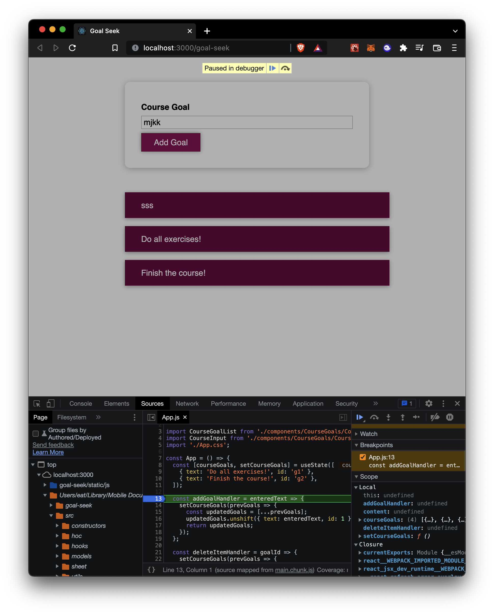
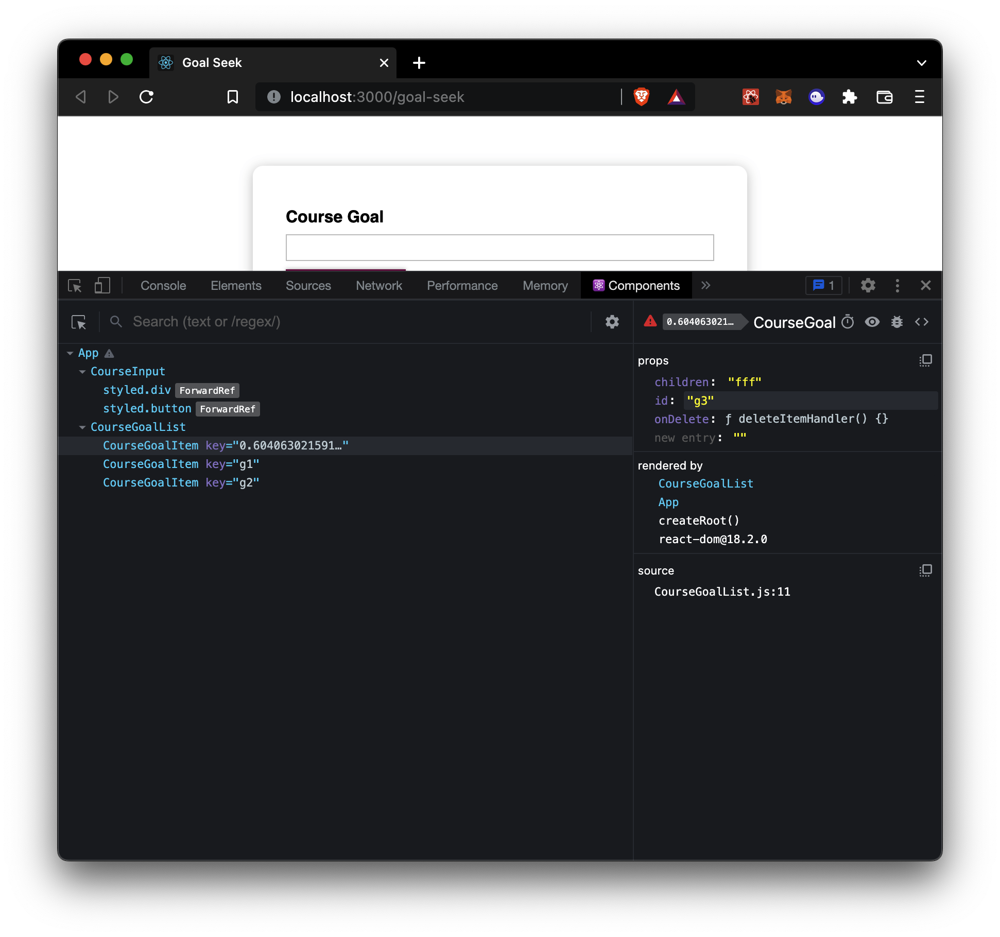

# Debugging React Apps

## Error messages

- When you don't have just one root element you'll have an error like this one:

  ```SHELL
  Failed to compile.

  ./Component.js
  SyntaxError: /Users/user/react-app/src/components/Component.js:
  Adjacent JSX elements must be wrapped in an enclosing tag.
  Did you want a JSX fragment <>...</>? (20:4)

  18 |       ))}
  19 |     </ul>
  > 20 |     <ul></ul>
      |     ^
  21 |   );
  22 | };
  23 |
  ```

  - Remember that a component is a `React.createElement()`object and you cannot render two of them in one component.

- Misspelling errors or using undefined variables

  ```SHELL
  Failed to compile.

  src/components/Component.js
  Line 73:21:  'someMisspelledFunction' is not defined  no-undef

  Search for the keywords to learn more about each error.

  ```

  - Make sure to write correctly every variable or function

- CodeFlow and Warnings

  ```SHELL
  index.js:1 Warning: Encountered two children with the same key, `someKey`.
  Keys should be unique so that components maintain their identity across updates.
  Non-unique keys may cause children to be duplicated and/or omitted — the behavior is unsupported and could change in a future version.
  at ul
  at Component (http://localhost:3000/react-app/static/js/main.chunk.js:719:23)
  at section
  at div
  at App (http://localhost:3000/react-app/static/js/main.chunk.js:215:95)
  ```

  - Use the error message to understand which part of the code is giving the error

    - It tells you the file `index.js: Warning...`
    - In the example tells you that something is repeating `Keys should be unique...`
    - It gives you the element where the problem is

      ```SHELL
      at ul
      at Component (http://localhost:3000/react-app/static/js/main.chunk.js:719:23)
      at section
      at div
      at App (http://localhost:3000/react-app/static/js/main.chunk.js:215:95)
      ```

    - This workflow gives you the clues to fix your Error

## Breakpoints

- Breakpoints are an In-Browser function that allows you to break a running in smaller steps
- You can access to them this way:
  - Open the developer tools `View` `Developer` `Developer Tools` or `⌥ ⌘ I`
  - Go to `Sources`
  - Find your `localhost` list
  - Open the directory with your local app path
  - Find the component you are debugging
  - Add the breakpoints you need by secondary clicking the line of code you want to debug
  - Now you'll go through every breakpoint until you find where is something wrong happening
    

## React Developer Tools

- This extension will allow you to check React specific problems

  - Components

    - This option will allow you to check your components tree and their specific attributes, like props, state, hooks, source code, etc.
    - You can modify the component from that window and see its behavior

    
