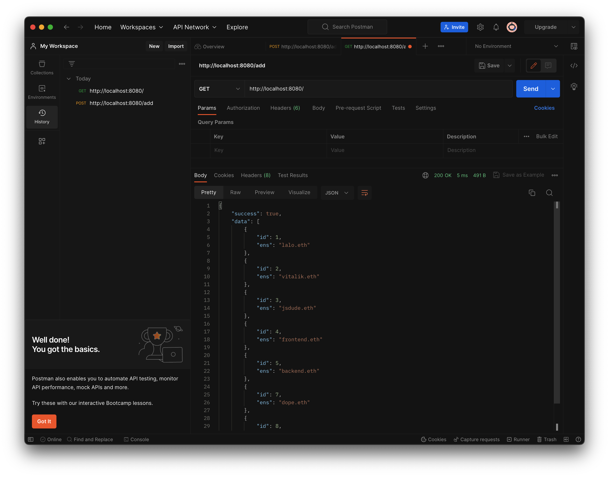

# Express

-   `npm install express` add the `--save` flag on some legacy projects
-   Framework that allows you to create servers using JavaScript
-   Simple example

    ```JS
    const express = require('express'),
        app = express(),
        PORT = 4040;

    // HTTP CRUD requests
    // GET route, (request, response) objects => Callback
    app.get('/', (req, res) => {
        // Sends a response to the client when the request is made
        res.status(200).send('Home page');
    });
    app.get('/about', (req, res) => {
        res.status(200).send('About page');
    });
    // POST
    app.post('/', (req, res) => {});
    // PUT
    app.put('/', (req, res) => {});
    // DELETE
    app.delete('/', (req, res) => {});
    // All is a wildcard request for all HTTP methods
    app.all('/', (req, res) => {});

    // Takes care of the middleware
    app.use('*', (req, res) => {
        res.status(404).send('<h1>404 Page not found</h1> ');
    });

    // Indicates that the server is running
    app.listen(PORT, () => {
        console.log(`Listening on port ${PORT}`);
    });
    ```

-   Serving static files using `app.use()`

    ```JS
    const express = require('express'),
        app = express(),
        PORT = 4040;

    // Setup all files in the public folder and middleware
    app.use(express.static('./public'));
    // If there is an index file it will be served by default

    app.use('*', (req, res) => {
        res.status(404).send('<h1>404 Page not found</h1> ');
    });

    app.listen(PORT, () => {
        console.log(`Listening on port ${PORT}`);
    });
    ```

## API vs SSR

-   API: send data, `res.json()`

    -   Interface to interact with our data
    -   Basic example

        ```JS
        // data.js
        // usually queried from a database
        const data = Array.from({ length: 100000 }, (_, i) => {
            return { id: i, name: 'test', age: Math.trunc(Math.random() * 100) };
        });

        module.exports = { data };
        ```

        ```JS
        const express = require('express'),
            { data } = require('./data.js'),
            app = express(),
            port = 4040;

        // It will send a json with the data from the file as response
        app.get('/', (req, res) => res.json(data));

        app.listen(port, () => console.log(`Example app listening on port ${port}!`));
        ```

    -   We need to control what data the user will receive from the request

        -   For example, we might need to send just the name items in the database and when the user clicks a button send all of the data of the item

            ```JS
            app.get('/', (req, res) => {
                const mappedData = data.map(item => {
                    const { id, name } = item;
                    return { id, name };
                });
                res.json(mappedData);
            });
            ```

    -   Parameters may be a good way to retreive data from a specific parameter

        ```JS
        app.get('/:id', (req, res) => {
            const { id } = req.params;
            const item = data.find(item => item.id === +id);
            if (!item) {
                return res.status(404).send('Product not found');
            }
            return res.json(item);
        });
        ```

        -   Parameters can be nested for more complex requests

            ```JS
            app.get('/:id/pets/:petID', (req, res) => {});
            ```

        -   Or can contain queries to perform specific actions, like adding a sorting query `/age?sorted=true`

            ```JS
            app.get('/age', (req, res) => {
                const { sorted } = req.query,
                    ages = data.map(item => item.age);

                if (sorted !== 'true' && sorted !== 'false')
                    return res.status(405).send('Query method not allowed');

                if (sorted === 'true')
                    return res.status(200).json(ages.sort((a, b) => a - b));

                return res.status(200).json(ages);
            });
            ```

        -   We should take care of sending just one response per request
            -   Check that is correctly conditioned
            -   Use return to finish the process
                -   If there's just one response scenario you can skip the `return` statement

-   SSR: render templates, send templates `res.render()`
    -   Send back entire `html` `css` `javascript` files

## Middleware

-   Middleware is the bridge between our server and our application

    -   `req -> middleware -> res`
    -   Useful when we need to pass a global behavior across our app

        ```JS
        const logger = (req, res, next) => {
            const { method, url } = req;
            console.log(`${method} ${url}`);
            next(); // Tells exprese to go to the next function
        };
        app.get('/', logger, (req, res) => res.json(data);)
        // Will send the data and also trigger logger with console message
        // GET /
        ```

        -   It's a good practice to keep these middlewares in different files and add them to our app using `app.use()`

            ```JS
            const express = require('express'),
                { data } = require('./data.js'),
                { logger } = require('./logger.js'),
                app = express(),
                port = 4040;

            app.use(logger);
            // All requests bellow logger will use them now
            app.get('/', (req, res) => res.json(data);)
            // ...
            ```

        -   You can use several middleware functions and also specific paths

            ```JS
            app.use('/', [logger, auth]); // order matters
            ```

        -   This behavior is very porwerful because it can pass state between requests, like an auth token

-   Third party middleware

    -   The most common is morgan `npm install morgan` and simplifies the process of logging requests to your application

        ```JS
        const express = require('express'),
            morgan = require('morgan'),
            app = express(),
            port = 4040;

        app.use(morgan('tiny'));
        ```

## HTTP Requests

-   `GET` - The GET method is used by web applications to retrieve data from a server.

    -   The `GET` method is typically used for retrieving information, such as web pages, images, videos, and other resources, from a server
    -   It is used to access data on the Internet

        ```JS
        // GET data form a database
        const morgan = require('morgan'),
            express = require('express'),
            sqlite3 = require('sqlite3').verbose(),
            app = express(),
            port = process.env.PORT || 8080;

        app.use(morgan('tiny'));

        app.get('/', (req, res) => {
            const db = new sqlite3.Database('./data.db');
            // Query all the data from the database
            db.all('SELECT * FROM users', (err, rows) => {
                if (err) {
                    res.status(500).send(err.message);
                    return; // Handles the error and stops the function
                }
                db.close();
                res.status(200).json({
                    success: true,
                    data: rows,
                }); // Sends the data to the client
            });
        });
        ```

-   `POST` - Is a request where a client (such as a web browser or a mobile app) can send data (JSON, XML) to a server in order to create a new resource on it

    ```JS
    const morgan = require('morgan'),
        express = require('express'),
        sqlite3 = require('sqlite3').verbose(),
        app = express(),
        port = process.env.PORT || 8080;

    // Middleware express.json() helps to parse the body
    app.use(morgan('tiny'), express.json());

    app.post('/add', (req, res) => {
        // Destructure the ens entry from the body
        const { ens } = req.body,
            db = new sqlite3.Database('./data.db');
        // Check that is a correct ens value
        if (!/^[a-z]+\.eth$/.test(ens)) {
            res.status(400).send('ENS must be lowercase and end with .eth');
            return;
        }
        // Create the entry into the database
        db.run('INSERT INTO users (ens) VALUES (?)', [ens], function (err) {
            if (err) {
                res.status(500).send(err.message);
                return; // Handles the error and stops the function
            }
            const id = this.lastID; // Autocompletes the ID
            db.close();
            res.status(201).json({
                success: true,
                data: { id, ens },
            }); // Sends ID and ENS to the client
        });
    });
    ```

    -   In this kind of requests the body is crucial to send a resource that later will be stored in the persistent data, in this example you'll need to send a valid `ens`
    -   Test it using `curl`
        -   Request
            ```SHELL
            curl --header "Content-Type: application/json" \
            --request POST \
            --data '{"ens":"vitalik.eth"}' \
            http://localhost:8080/add
            ```
        -   Response
            ```SHELL
            {"success":true,"data":{"id":2,"ens":"vitalik.eth"}}
            ```
    -   Or with JavaScript and node

        ```JS
        const axios = require('axios'),
            ens = process.argv[2];
        // Axios is a library that makes easier to make requests
        // process.argv[2] is used to take arguments from CLI
        async function main() {
            // makes sure to have an argument
            if (!ens) throw new Error('Missing argument: ens');
            // makes the request
            const response = await axios.post('http://localhost:8080/add', { ens });
            // if everything goes well returns the data from the response
            console.log(response.data);
            return response.data;
        }

        main()
            .then(() => {
                process.exit(0);
            })
            .catch(err => {
                console.error(err);
                process.exit(1);
            });
        ```

        -   Request
            ```Shell
            node add.js jsdude.eth
            ```
        -   Response
            ```Shell
            { success: true, data: { id: 3, ens: 'jsdude.eth' } }
            ```

    -   JavaScript can also be wired to the frontend and use events to trigger the call, like in this react example

        ```JSX
        import { useState } from 'react';
        import axios from 'axios';
        import './App.css';

        function App() {
            const [ens, setEns] = useState(''),
                addEns = async () => {
                    try {
                        if (!ens) throw new Error('Not ENS provided');
                        const response = await axios.post('http://localhost:8080/add', {
                                ens,
                            }),
                            data = response.data.data;
                        alert(`Added ${data.ens} with id ${data.id}`);
                    } catch (error) {
                        alert(error);
                    }
                };
            return (
                <div className='add'>
                    <input
                        type='text'
                        onChange={e => setEns(e.target.value)}
                        value={ens}
                    />
                    <button onClick={addEns}>Add</button>
                </div>
            );
        }

        export default App;
        ```

    -   You can also use apps like [postman](https://www.postman.com/downloads/) to meke your life easier

        
